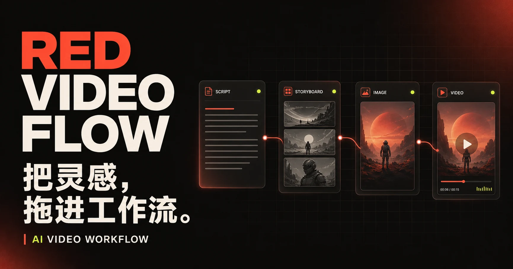
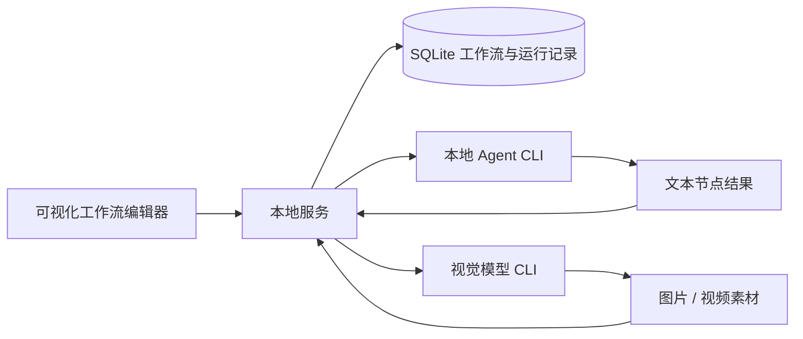

<p align="center">
  
</p>

<h1 align="center">Red Video Flow</h1>

<p align="center">
  <strong>把灵感，拖进工作流。</strong><br />
  由本地 Agent CLI 驱动的 AI 视频工作流，从脚本、分镜、图片到视频，让每一步生成都可连接、可追踪、可重跑。
</p>

<p align="center">
  <a href="https://julian-huang-1.github.io/red-vedio-flow/">在线官网</a>
  ·
  <a href="#快速开始">快速开始</a>
  ·
  <a href="#workflow-cli">Workflow CLI</a>
  ·
  <a href="#项目结构">项目结构</a>
</p>

## Red Video Flow 是什么？

Red Video Flow 是一个本地优先的 AI 视频工作流工具。它把你已经在使用的 Codex、Claude Code、Gemini CLI、Cursor Agent 等本地 Agent 接入可视化节点，让 Agent 不只给出建议，而是直接参与工作流执行。

每个节点既保存当前素材，也是下游节点的上下文。你可以从一段灵感开始，逐步生成脚本、分镜、图片和视频，并在任意环节替换 Agent、修改提示词或重新执行。

## 核心能力

- **可视化素材工作流**：使用文本、图片、视频节点组织创作过程与依赖关系。
- **本地 Agent 自动发现**：扫描 `PATH` 和常用安装目录，识别本机已安装的 Agent CLI。
- **上下文自动注入**：执行节点时自动携带当前节点、上游素材、引用节点与最近对话。
- **文本与视觉任务分流**：文本节点交给 Agent CLI，图片和视频节点交给视觉模型。
- **可靠的节点回写**：记录 `start`、`heartbeat`、`complete`、`fail` 生命周期，使用 revision 避免并行更新互相覆盖。
- **本地数据与素材管理**：工作流、运行记录和素材默认保存在本机 SQLite 与本地目录中。
- **Web 与桌面端**：既可以在浏览器中开发运行，也可以构建 Electron 桌面应用。

## 工作方式



浏览器负责编辑体验，本地服务负责工作流、素材、Agent 进程和执行状态。工作流与素材默认保存在本机；实际模型请求是否离开本机，取决于你选择的 Agent CLI 和模型配置。

## 快速开始

### 环境要求

- Node.js `22.x`
- pnpm
- 至少安装一个受支持的 Agent CLI；没有 Agent 时仍可使用本地 fallback 文本

### 启动开发环境

```bash
git clone git@github.com:Julian-Huang-1/red-vedio-flow.git
cd red-vedio-flow

corepack enable
pnpm install
pnpm dev
```

启动后打开：

- Web 编辑器：`http://127.0.0.1:5175`
- 本地 API：`http://127.0.0.1:5176`

如果 `5176` 已被占用，本地服务会向后寻找可用端口；此时可以通过 `RED_VIDEO_FLOW_AGENT_PORT` 指定端口。

## 本地 Agent CLI

项目当前可以检测 20 个 Agent CLI，其中以下 Agent 已接入直接调用：

| Agent | 默认命令 | 协议 |
| --- | --- | --- |
| OpenAI Codex | `codex` | stdin / JSON stream |
| Claude Code | `claude` | stdin / JSON stream |
| Gemini CLI | `gemini` | stdin / JSON stream |
| Cursor Agent | `cursor-agent` | stdin / JSON stream |
| GitHub Copilot CLI | `copilot` | stdin / JSON |
| OpenCode | `opencode-cli` / `opencode` | stdin / JSON |
| Qwen Coder | `qwen` | stdin |
| Qoder CLI | `qodercli` | stdin / JSON stream |
| Aider | `aider` | stdin |
| OpenClaw | `openclaw` | argv message / JSON |
| IBM Bob Shell | `bob` | stdin / JSON stream |
| CodeWhale | `codewhale` | argv |
| DeepSeek TUI | `deepseek-tui` | argv |

Hermes、Kimi CLI、Devin CLI、Kiro CLI、Kilo Code、Mistral Vibe CLI 和 Pi CLI 目前支持检测与展示，ACP / PI-RPC 的直接调用仍在接入中。

如果 CLI 不在默认 `PATH` 中，可以使用对应环境变量指定可执行文件，例如：

```bash
export CODEX_BIN=/path/to/codex
export CLAUDE_BIN=/path/to/claude
export GEMINI_BIN=/path/to/gemini
```

视觉节点当前接入即梦 Dreamina CLI，覆盖文生图、图生图、文生视频、图生视频、多帧生视频和图片放大等能力。

## Workflow CLI

`rvf` 面向开发者和 Agent，输出稳定 JSON。它可以读取工作流、查询上下游节点、增量修改节点，以及完整执行一个文本或视觉节点。

在仓库内启用命令：

```bash
alias rvf='pnpm --filter @red-video-flow/workflow-cli start --'
rvf help
```

常用命令：

```bash
# 查看工作流
rvf workflow list
rvf workflow get <workflowId>

# 查看节点及其上游
rvf workflow node get <workflowId> <nodeId>
rvf workflow upstream <workflowId> <nodeId>

# 使用本地 Agent 执行文本节点
rvf workflow node run <workflowId> <nodeId> \
  --prompt "把灵感扩写成 60 秒短剧脚本" \
  --agent-id codex

# 使用视觉模型执行图片或视频节点
rvf workflow node run <workflowId> <nodeId> \
  --prompt "电影感火星基地，纵向构图" \
  --model-id dreamina
```

正常执行优先使用 `workflow node run`。自定义外部执行器可以使用 `start`、`heartbeat`、`complete` 和 `fail` 原子命令接管节点生命周期。

## 常用脚本

| 命令 | 说明 |
| --- | --- |
| `pnpm dev` | 同时启动本地服务和 Web 编辑器 |
| `pnpm dev:web` | 只启动 Web 编辑器 |
| `pnpm dev:agents` | 只启动本地服务 |
| `pnpm dev:electron` | 启动 Electron 桌面端开发环境 |
| `pnpm build` | 构建所有 workspace package |
| `pnpm test` | 运行单元测试 |
| `pnpm test:e2e` | 运行端到端测试 |
| `pnpm dist:mac` | 构建 macOS 桌面安装包 |
| `pnpm dist:win` | 构建 Windows 桌面安装包 |

## 项目结构

```text
red-vedio-flow/
├── apps/
│   ├── web/               # React + Vite 可视化工作流编辑器
│   ├── local-server/      # 本地 HTTP / SSE 服务与静态资源服务
│   ├── electron/          # Electron 桌面应用
│   └── doc/               # 项目介绍官网
├── packages/
│   ├── workflow-core/     # 节点、边、图规则与领域类型
│   ├── workflow-client/   # 浏览器侧 HTTP / SSE client
│   ├── workflow-runtime/  # 文本 Agent / 视觉模型执行策略
│   ├── workflow-cli/      # rvf 工作流 CLI
│   └── local-backend/     # SQLite、工作流、素材与 Agent 服务
└── tests/                 # 端到端测试
```

## 本地数据

开发环境默认把数据写入：

```text
apps/local-server/.data/
├── red-video-flow.sqlite
├── uploads/
└── generated/
```

可以通过 `RED_VIDEO_FLOW_DATA_DIR` 把数据目录指向其他位置。

## 开发状态

项目仍在快速迭代中，工作流结构、CLI 参数和视觉模型适配可能继续调整。欢迎通过 Issue 反馈本地 Agent 兼容性、工作流体验和视觉生成问题。
